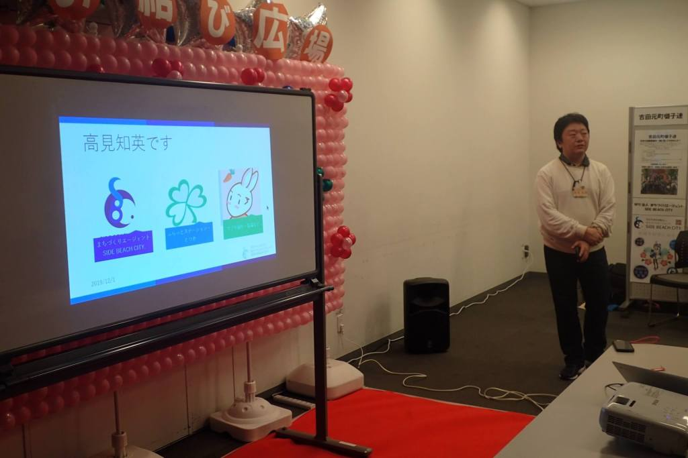

# WebRhythm

まちづくりエージェント SIDE BEACH CITY.が地域イベントで使用している、タッチで音を鳴らせるWebアプリです。

Web Audio APIを使用しており、最近のWebブラウザであれば、Github Pagesのページを開くだけでも試遊が可能です(現行のバージョンは、Windows/Mac/AndroidのChromeでしか動作しません)。

* [Github Pagesはこちら](https://side-beach-city.github.io/WebRhythm/)

## 特徴

* すべてHTML5＋JavaScriptベース＋外部ライブラリ(CDN経由)なので、Github Pagesですべての機能を試遊可能です。
  * 自環境でテストしたいときも、HTML5＋JavaScriptだけなので簡単に動作環境が作れます。
* 作成した楽譜データを、保存することができます(ブラウザのLocalStorageに保存されます。
* 保存した楽譜データを、別の端末にQRコード経由で送ることが可能です。
  * 再生中の楽譜を他の端末に送る機能も実装予定です。

また、シンプルさを追求するため

* 1オクターブ内の音楽は再生できません
* ♯、♭の入る音楽は再生できません

シンプルさを損なわない実装方法があれば、検討するかも。

## ねらい

まちづくりエージェント SIDE BEACH CITY.は、ITを使った地域課題の解決を目指す団体です。

しかし、地域課題の真の解決を図るためには、IT技術者以外のデジタル技術に関する理解度向上も、併せて行っていく必要があると考えています。

このため、まちづくりエージェント SIDE BEACH CITY.は今まで、横浜市内各地の地域イベントにて、パソコンやスマートフォンのことがなんとなくわかるようなパフォーマンスを行ってきました。

地域には、パソコン・スマートフォンに全く関わらない。また「なんとなく難しそう」ということから、デジタル技術を敬遠してしまう という人がたくさんいます。

このような人が地域課題解決の中心人物になっているということも少なくなく、わたしたちまちづくりエージェント SIDE BEACH CITY.は、そのような人にデジタル技術を知ってもらう、興味を持ってもらうことは重要であると考えています。

ただ、現状できることだけを見せても、そのような人はより殻に閉じこもってしまうだけ。

まずは細かい技術やできることはいいので、パソコン・スマートフォンに興味を持ってほしい ということで、このアプリを作成しました。

2019年12月には、とつかお結び広場での出展も行いました。

## 今後の予定

* よりさまざまな環境で動作するようにする
* Tone.jsの導入などにより、より表現力のある音楽を再生できるようにする
* 自動伴奏機能やグラフィカルなエフェクトの実装など、より注目を集められるアプリ製作
* PWA対応などアプリとして実行できる環境構築
* 2020年以降、区民センターイベントでの展示・出展

詳しくは[Issue](https://github.com/side-beach-city/WebRhythm/issues)をご覧ください。

### 対応予定のブラウザ

* Android：Chrome、古いバージョンのWebkit
  * Androidガラホ向けブラウザ(含むテンキー入力)
* iPhone/iPadブラウザ：Safari
* Windowsブラウザ：Edge、Chrome、Firefox
* Macブラウザ：Safari、Chrome、Firefox

※ Windows用Internet Explorerおよび、Chromium EdgeのInternet Explorerモードへの対応予定はありません。

## 自環境での環境構築

ES Modulesを利用していますので、file:// スキームではアプリの実行が行えません。

現状ではPHPのビルトインブラウザを使うのが一番手軽です(PHPのインストールが必要です)。

1. `git clone https://github.com/side-beach-city/WebRhythm.git`でリポジトリをクローンする
2. index.htmlがあるフォルダをカレントディレクトリとして、`php -S 127.0.0.1:8080 .`を実行する。
3. ブラウザで、[http://127.0.0.1:8080/](http://127.0.0.1:8080/)を表示する
